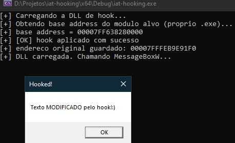

# Windows IAT Hooking
Intercept Win32 API calls by patching the Import Address Table
## How does it work?
This project demonstrates IAT (Import Address Table) hooking by intercepting calls to `MessageBoxW` from `USER32.dll`. The DLL replaces the function pointer in the target executable's IAT with a custom handler, redirecting all calls to our code.
The project also includes manual reimplementations of `GetModuleHandle` (via PEB walking) and `GetProcAddress` (via Export Directory parsing), built from scratch using only the Windows SDK no Detours, no MinHook.

## Demo

For more detailed technical analysis and study notes on PE format and IAT hooking, check out my personal study blog:
[Understanding the PE structure — Part 1](https://cnthigu.github.io/estrutura-pe-parte1/)

Note: This is my personal study blog with technical notes. If it helps with your learning, feel free to use!

