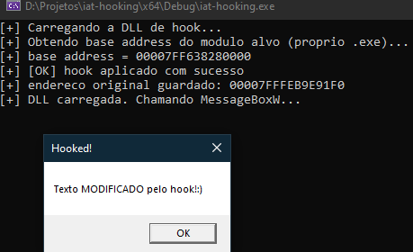

# Windows IAT Hooking

Intercept Win32 API calls by patching the Import Address Table

## How does it work?

The DLL finds `MessageBoxW` from `USER32.dll` in the target executable's IAT and replaces its function pointer with a custom handler.

It also includes manual versions of `GetModuleHandle` through PEB walking and `GetProcAddress` through Export Directory parsing. Just the Windows SDK, no Detours or MinHook.

## Demo

For my study notes on the PE format and IAT hooking:

**[Understanding the PE structure — Part 1](https://cnthigu.github.io/estrutura-pe-parte1/)**

This is my personal study blog. If it helps with your learning, feel free to use it.
